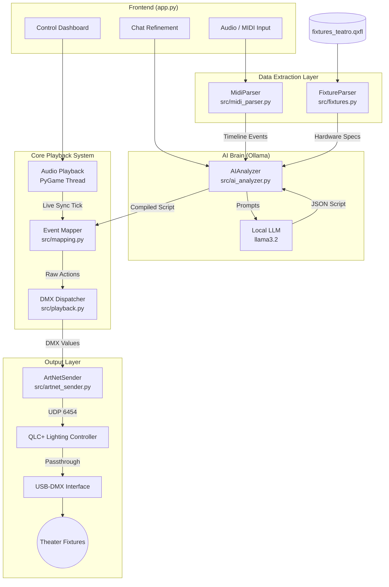

# AudioToLights

AudioToLights is an intelligent, hardware-agnostic system that bridges the gap between music production and automated theatrical lighting control. It utilizes local Generative AI (LLMs) to analyze rhythmic layouts off an audio+MIDI timeline and synthetically choreograph a dynamic DMX lighting show.


## Features
- **AI-Driven Scenography**: Feeds structural MIDI events to a local LLM via Ollama (e.g., Llama 3.2). The LLM acts as an autonomous lighting designer, assigning precise DMX operations based on musical energy.
- **Hardware Integration**: Dynamically parses real-world QLC+ stage files (`.qxfl`), adjusting itself automatically to your venue's equipment (Wash, Beams, Fresnels, LED Bars) without manual hardcoding.
- **Natural Language Control**: Includes a Chat-Refinement UI where technicians can override lighting behaviors with natural language (e.g. "Dim everything to 0 for the first 10 seconds"). 
- **Art-Net Translation**: In-house mapping engine computes specific footprint behaviors like Color Wheel simulation for ATOMIC BEAM 7Rs and pixel mapping for 18-channel LED strips, forwarding all events natively via Art-Net UDP protocol (0.0.0.0:6454).
- **Web-based Control Board**: Real-time synchronous playback and visualization through a single-page Streamlit application.

## System Architecture




## Requirements
- `Python 3.10+`
- `Ollama` installed and running locally with the target model (default: `llama3.2`)
- Required Python modules: 
  ```bash
  pip install -r requirements.txt
  ```
  *(Packages: streamlit, pygame, mido, requests, python-dotenv)*

## Getting Started
1. Start Ollama locally.
2. Ensure your QLC+ venue file is exported to `fixtures_teatro.qxfl` in the root folder.
3. Launch the Control Board:
   ```bash
   start_app.bat
   ```
4. Upload your Audio track (`.MP3`/`.WAV`) and matching Timeline (`.MID`).
5. Click **Generate Colors and Dynamics**.
6. Turn on QLC+ with Art-Net Input and your DMX-USB adapter output.
7. Click **LIVE PLAY**!
